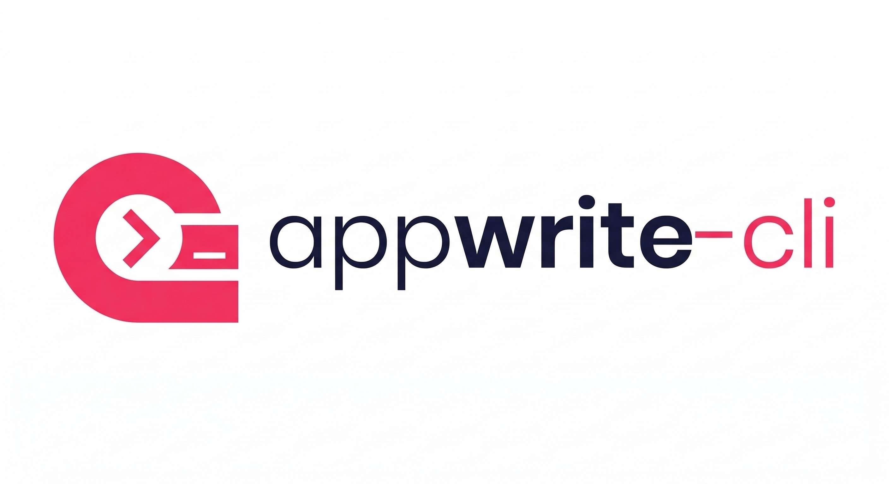

<div align="center">

<br>



<br>
<br>

**A fast, single-binary CLI for Appwrite — built for power users and CI/CD.**

<br>

[](https://github.com/AndroidPoet/appwrite-cli/releases/latest)
&nbsp;
[](https://github.com/AndroidPoet/appwrite-cli/releases)
&nbsp;
[](https://go.dev)
&nbsp;
[](LICENSE)

</div>

<br>

## Why This Exists

Appwrite has an official CLI built on Node.js. This is something different.

| | Official CLI | appwrite-cli |
|:--|:--|:--|
| **Runtime** | Requires Node.js | Single binary, zero dependencies |
| **Auth** | One project at a time | Named profiles — switch instantly |
| **Output** | Text | 6 formats: JSON, table, CSV, TSV, YAML, minimal |
| **Self-hosted** | Requires manual config | First-class `--endpoint` per profile |
| **Environments** | No comparison | `aw diff --source staging --target production` |
| **IaC** | Push/pull workflow | `aw export` / `aw import` — full YAML config |
| **Monitoring** | None | `aw watch` — live terminal dashboard |
| **Diagnostics** | None | `aw doctor` — validate everything in one command |
| **CI/CD** | Needs Node setup | Drop in binary, set env vars, go |
| **Completions** | Basic | Dynamic — tab-complete database IDs, function names |

<br>

## Quick Install

```bash
brew tap AndroidPoet/tap && brew install appwrite-cli
```

Or download from [Releases](https://github.com/AndroidPoet/appwrite-cli/releases/latest). After install, use `appwrite-cli` or the alias `aw`.

## Setup

```bash
# Cloud
aw auth login --api-key your_api_key_here

# Self-hosted
aw auth login --api-key your_key --endpoint https://appwrite.example.com/v1 --name self-hosted

# Initialize project
aw init --project your_project_id

# Verify everything works
aw doctor
```

## Command Overview

> **75+ commands** across **13 resource groups** covering the full Appwrite REST API.

| Category | Commands | What you can do |
|:---------|:---------|:----------------|
| **Databases** | `list` `get` `create` `update` `delete` | Manage databases |
| **Collections** | `list` `get` `create` `update` `delete` `list-attributes` `list-indexes` | Schema management |
| **Documents** | `list` `get` `create` `update` `delete` | CRUD with JSON data |
| **Storage** | `list-buckets` `get-bucket` `create-bucket` `update-bucket` `delete-bucket` `list-files` `get-file` `delete-file` | Buckets and files |
| **Functions** | `list` `get` `create` `update` `delete` `list-executions` `list-variables` `list-deployments` | Serverless functions |
| **Users** | `list` `get` `create` `update-name` `update-email` `delete` `list-sessions` `list-logs` | User management |
| **Teams** | `list` `get` `create` `update` `delete` `list-members` | Team management |
| **Messaging** | `list-messages` `get-message` `list-topics` `get-topic` `create-topic` `delete-topic` `list-providers` | Push, email, SMS |
| **Health** | `get` `db` `cache` `storage` `queue` | Instance health checks |
| **Auth** | `login` `switch` `list` `current` `delete` | Multi-profile auth |

### Power Commands

| Command | Description |
|:--------|:------------|
| `aw status` | Project overview dashboard — databases, functions, buckets, users, teams |
| `aw doctor` | Diagnostic checks — config, API key, project, endpoint, connectivity |
| `aw watch health` | Live health monitoring with auto-refresh |
| `aw watch metrics` | Live project metrics dashboard |
| `aw diff --source staging --target prod` | Compare resource counts across environments |
| `aw export --file infra.yaml` | Export databases + collections + schemas to YAML |
| `aw import --file infra.yaml` | Import infrastructure from YAML |
| `aw report` | Generate comprehensive project report |

<br>

## Commands

### Databases

```bash
aw databases list
aw databases list --all -o table
aw databases get --database-id mydb
aw databases create --name "Production DB"
aw databases create --database-id mydb --name "My Database" --enabled
aw databases update --database-id mydb --name "Renamed DB"
aw databases delete --database-id mydb --confirm
```

### Collections

```bash
aw collections list --database-id mydb
aw collections get --database-id mydb --collection-id users
aw collections create --database-id mydb --name "Users" --document-security
aw collections update --database-id mydb --collection-id users --name "App Users"
aw collections delete --database-id mydb --collection-id users --confirm
aw collections list-attributes --database-id mydb --collection-id users
aw collections list-indexes --database-id mydb --collection-id users
```

### Documents

```bash
aw documents list --database-id mydb --collection-id users
aw documents list --database-id mydb --collection-id users --all -o csv
aw documents get --database-id mydb --collection-id users --document-id doc123
aw documents create --database-id mydb --collection-id users \
  --data '{"name":"Alice","email":"alice@example.com"}'
aw documents update --database-id mydb --collection-id users --document-id doc123 \
  --data '{"name":"Alice Updated"}'
aw documents delete --database-id mydb --collection-id users --document-id doc123 --confirm
```

### Storage

```bash
aw storage list-buckets
aw storage get-bucket --bucket-id uploads
aw storage create-bucket --name "User Uploads" --max-file-size 10000000 --encryption --antivirus
aw storage update-bucket --bucket-id uploads --name "Media" --compression gzip
aw storage delete-bucket --bucket-id uploads --confirm
aw storage list-files --bucket-id uploads
aw storage get-file --bucket-id uploads --file-id file123
aw storage delete-file --bucket-id uploads --file-id file123 --confirm
```

### Functions

```bash
aw functions list
aw functions get --function-id myfunc
aw functions create --name "Process Order" --runtime node-18.0 --timeout 30
aw functions update --function-id myfunc --name "Process Order v2" --timeout 60
aw functions delete --function-id myfunc --confirm
aw functions list-executions --function-id myfunc
aw functions list-variables --function-id myfunc
aw functions list-deployments --function-id myfunc
```

### Users

```bash
aw users list
aw users list --all -o table
aw users get --user-id user123
aw users create --email alice@example.com --password secret123 --name "Alice"
aw users update-name --user-id user123 --name "Alice Smith"
aw users update-email --user-id user123 --email newemail@example.com
aw users delete --user-id user123 --confirm
aw users list-sessions --user-id user123
aw users list-logs --user-id user123
```

### Teams

```bash
aw teams list
aw teams get --team-id engineering
aw teams create --name "Engineering" --roles admin,member
aw teams update --team-id engineering --name "Platform Engineering"
aw teams delete --team-id engineering --confirm
aw teams list-members --team-id engineering
```

### Messaging

```bash
aw messaging list-messages
aw messaging get-message --message-id msg123
aw messaging list-topics
aw messaging get-topic --topic-id announcements
aw messaging create-topic --name "Announcements"
aw messaging delete-topic --topic-id announcements --confirm
aw messaging list-providers
```

### Health

```bash
aw health get                    # Overall health
aw health db                     # Database health
aw health cache                  # Cache health
aw health storage                # Storage health
aw health queue                  # Queue health
```

### Status & Monitoring

```bash
aw status                        # Project dashboard
aw watch health                  # Live health monitoring
aw watch metrics                 # Live project metrics
aw watch metrics --interval 10   # Custom refresh (seconds)
```

### Export, Import & Diff

```bash
aw export --file infra.yaml                        # Export project to YAML
aw import --file infra.yaml --dry-run              # Preview import
aw import --file infra.yaml                        # Apply import
aw diff --source staging --target production       # Compare environments
aw report                                          # Full project report
```

### Auth & Setup

```bash
# Multi-profile management
aw auth login --api-key key_xxx --name production
aw auth login --api-key key_xxx --name staging --endpoint https://staging.example.com/v1
aw auth switch --name staging
aw auth list
aw auth current
aw auth delete --name old --confirm

# Project setup
aw doctor                                          # Verify configuration
aw init --project proj_xxx                         # Create .aw.yaml
aw init --project proj_xxx --endpoint https://self-hosted.example.com/v1

# Shell completions
aw completion bash > /usr/local/etc/bash_completion.d/aw
aw completion zsh > "${fpath[1]}/_aw"
aw completion fish > ~/.config/fish/completions/aw.fish
```

## Output Formats

```bash
aw databases list                # JSON (default)
aw databases list --pretty       # Pretty JSON
aw databases list -o table       # Table
aw databases list -o csv         # CSV
aw databases list -o tsv         # TSV
aw databases list -o yaml        # YAML
aw databases list -o minimal     # IDs only (for scripting)
```

### Pipe-friendly

```bash
# Get all database IDs
aw databases list -o minimal

# Export users to CSV
aw users list --all -o csv > users.csv

# Count functions
aw functions list --all -o minimal | wc -l

# Use with jq
aw databases list --pretty | jq '.[].name'
```

## Pagination

```bash
aw users list --limit 50
aw users list --limit 50 --offset 50
aw users list --all                    # Fetch everything
```

## Multi-Profile Auth

Manage multiple Appwrite instances — cloud, self-hosted, staging, production — all from one CLI.

```bash
# Configure profiles
aw auth login --api-key cloud_key --name cloud
aw auth login --api-key self_key --name selfhosted --endpoint https://aw.mycompany.com/v1
aw auth login --api-key staging_key --name staging --endpoint https://staging.mycompany.com/v1

# Switch between them
aw auth switch --name staging
aw databases list -p my_project_id

# Or use env vars in CI
AW_API_KEY=xxx AW_PROJECT=yyy AW_ENDPOINT=https://... aw databases list
```

## Environment Variables

| Variable | Flag | Description |
|:---------|:-----|:------------|
| `AW_API_KEY` | — | API key (overrides profile) |
| `AW_PROJECT` | `--project` | Project ID |
| `AW_ENDPOINT` | `--endpoint` | Appwrite endpoint URL |
| `AW_PROFILE` | `--profile` | Auth profile name |
| `AW_OUTPUT` | `--output` | Output format |
| `AW_DEBUG` | `--debug` | Show API requests/responses |
| `AW_TIMEOUT` | `--timeout` | Request timeout |

## Configuration

### Global config

Stored at `~/.appwrite-cli/config.json`:

```json
{
  "default_profile": "production",
  "profiles": {
    "production": {
      "name": "production",
      "api_key": "your_key",
      "endpoint": "https://cloud.appwrite.io/v1",
      "default_project": "proj_xxx"
    },
    "staging": {
      "name": "staging",
      "api_key": "staging_key",
      "endpoint": "https://staging.example.com/v1"
    }
  }
}
```

### Project config

Create `.aw.yaml` in your project root:

```yaml
project: your_project_id
endpoint: https://cloud.appwrite.io/v1
output: table
```

Auto-discovered from current or parent directories.

## Install

### Homebrew (macOS / Linux)

```bash
brew tap AndroidPoet/tap && brew install appwrite-cli
```

### Go Install

```bash
go install github.com/AndroidPoet/appwrite-cli/cmd/appwrite-cli@latest
```

### Binary Download

Download the latest binary for your platform from [Releases](https://github.com/AndroidPoet/appwrite-cli/releases/latest).

| Platform | Architecture | File |
|:---------|:-------------|:-----|
| macOS | Apple Silicon | `appwrite-cli_*_darwin_arm64.tar.gz` |
| macOS | Intel | `appwrite-cli_*_darwin_amd64.tar.gz` |
| Linux | x86_64 | `appwrite-cli_*_linux_amd64.tar.gz` |
| Linux | ARM64 | `appwrite-cli_*_linux_arm64.tar.gz` |
| Windows | x86_64 | `appwrite-cli_*_windows_amd64.zip` |

### Linux Packages

```bash
# Debian / Ubuntu
sudo dpkg -i appwrite-cli_*_amd64.deb

# RHEL / Fedora
sudo rpm -i appwrite-cli_*_amd64.rpm
```

## How Releases Work

Releases are fully automated via GitHub Actions and [GoReleaser](https://goreleaser.com).

```
Push v* tag  →  CI runs tests  →  GoReleaser builds  →  GitHub Release created
                                       │
                                       ├── Binaries (macOS, Linux, Windows × amd64/arm64)
                                       ├── .deb and .rpm packages
                                       ├── Homebrew formula updated (AndroidPoet/homebrew-tap)
                                       └── Checksums (checksums.txt)
```

### Creating a release

```bash
git tag v0.1.0
git push origin v0.1.0
```

### CI

Every push and PR to `master` runs:
- `go build ./...`
- `go test ./... -v -race`
- `go vet ./...`

## Contributing

```bash
git clone https://github.com/AndroidPoet/appwrite-cli.git
cd appwrite-cli
make deps      # Download dependencies
make build     # Build binary to bin/
make test      # Run tests
make lint      # Run linter
```

## License

MIT

---

<div align="center">
<sub>Not affiliated with Appwrite.</sub>
</div>
